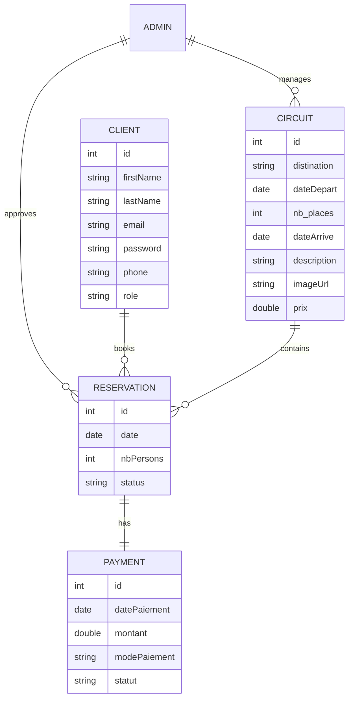

## Core entities

The backend persistence model is built around a small set of JPA entities:

- [back-end/src/main/java/com/demo/backend/Entity/Client.java](../../back-end/src/main/java/com/demo/backend/Entity/Client.java#L10-L39) stores personal information, the hashed password, phone, role, and the one-to-many relationship to reservations.
- [back-end/src/main/java/com/demo/backend/Entity/Circuit.java](../../back-end/src/main/java/com/demo/backend/Entity/Circuit.java#L9-L44) stores the trip destination, departure and arrival dates, availability, description, image URL, price, and a computed trip duration.
- [back-end/src/main/java/com/demo/backend/Entity/Reservation.java](../../back-end/src/main/java/com/demo/backend/Entity/Reservation.java#L10-L40) joins a client, an admin, and a circuit, and tracks a reservation status and date.
- [back-end/src/main/java/com/demo/backend/Entity/Payment.java](../../back-end/src/main/java/com/demo/backend/Entity/Payment.java#L8-L29) stores payment metadata for a reservation, including amount, date, mode, and status.
- [back-end/src/main/java/com/demo/backend/Entity/Admin.java](../../back-end/src/main/java/com/demo/backend/Entity/Admin.java) is the administrative owner record that links to circuits and reservations. The file is in the same package and participates in the same persistence graph.

## Relationships

The persistence model is a conventional but slightly denormalized travel-booking schema:



A caption for the diagram above: the entity model centers on a reservation that links a client to a trip and can be paid for through a payment record.

## Business meaning of the relationships

- A client can have many reservations, and each reservation belongs to a single client.
- A circuit can be booked in many reservations, and each reservation refers to one circuit.
- A reservation is also tied to a single admin as the managing agent.
- A payment is linked one-to-one with a reservation and records payment status after PayPal capture.

The main logic for these relationships is enforced in the business layer:

- [ReservationService.java](../../back-end/src/main/java/com/demo/backend/Service/ReservationService.java#L20-L83) creates a reservation from the logged-in client and available circuit inventory.
- [PaypalService.java](../../back-end/src/main/java/com/demo/backend/Service/PaypalService.java#L27-L60) marks a reservation as `PAID` and persists a payment row.
- [ClientService.java](../../back-end/src/main/java/com/demo/backend/Service/ClientService.java#L41-L87) builds DTOs that summarize per-client reservation counts and totals.

## Important invariants from the code

- The `Client.password` field is `WRITE_ONLY` in JSON, preventing the password from being returned in API responses.
- The `Circuit` entity exposes a computed `duration` property read-only, derived from departure and arrival dates.
- Reservation creation reduces available `nb_places` and cancellation restores them.
- Payment creation is conditional on successful PayPal completion; the code checks `response.result().status().equals("COMPLETED")` before writing the payment.

## Validation

The current test coverage focuses on client registration and DTO logic rather than the whole relational model. The strongest repository evidence is the service test suite in [back-end/src/test/java/com/demo/backend/ClientServiceTest.java](../../back-end/src/test/java/com/demo/backend/ClientServiceTest.java#L17-L205). The broader validation command remains:

```bash
cd back-end && ./mvnw test
```
