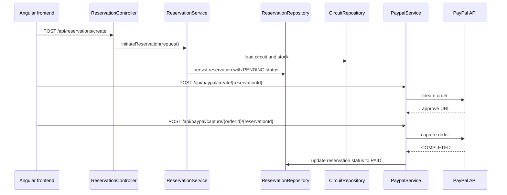

## What this service owns

The backend is the core business service for the application. It is started by Spring Boot in [back-end/src/main/java/com/demo/backend/BackEndApplication.java](../../back-end/src/main/java/com/demo/backend/BackEndApplication.java#L1-L12), which runs the application with `@SpringBootApplication`. The service owns the REST API for authentication, client account management, catalog operations, reservation processing, and PayPal integration.

The main REST surfaces are implemented in the controller layer:

- [back-end/src/main/java/com/demo/backend/Controller/AuthController.java](../../back-end/src/main/java/com/demo/backend/Controller/AuthController.java#L18-L93) handles login, logout, and registration.
- [back-end/src/main/java/com/demo/backend/Controller/ClientController.java](../../back-end/src/main/java/com/demo/backend/Controller/ClientController.java#L12-L76) exposes client profile and admin/client listing operations.
- [back-end/src/main/java/com/demo/backend/Controller/CircuitController.java](../../back-end/src/main/java/com/demo/backend/Controller/CircuitController.java#L10-L79) exposes catalog discovery and mutation.
- [back-end/src/main/java/com/demo/backend/Controller/ReservationController.java](../../back-end/src/main/java/com/demo/backend/Controller/ReservationController.java#L10-L68) exposes reservation creation, cancel, update, and revenue queries.
- [back-end/src/main/java/com/demo/backend/Controller/PaypalController.java](../../back-end/src/main/java/com/demo/backend/Controller/PaypalController.java#L10-L29) creates and captures PayPal orders for a reservation.

## Service structure and responsibilities

The business logic lives in the service layer:

- [back-end/src/main/java/com/demo/backend/Service/ClientService.java](../../back-end/src/main/java/com/demo/backend/Service/ClientService.java#L13-L87) handles registration, updating, deletion, and DTO conversion for clients.
- [back-end/src/main/java/com/demo/backend/Service/CircuitService.java](../../back-end/src/main/java/com/demo/backend/Service/CircuitService.java#L10-L64) manages catalog reads, updates, deletion, and destination aggregation.
- [back-end/src/main/java/com/demo/backend/Service/ReservationService.java](../../back-end/src/main/java/com/demo/backend/Service/ReservationService.java#L14-L104) owns the reservation lifecycle, seat inventory changes, and current-user filtering.
- [back-end/src/main/java/com/demo/backend/Service/PaypalService.java](../../back-end/src/main/java/com/demo/backend/Service/PaypalService.java#L15-L60) creates PayPal orders and records successful payment state changes.

These services are wired by Spring through component scanning and `@Service` annotations. The application also exposes the application security setup in [back-end/src/main/java/com/demo/backend/Configuration/SecurityConfig.java](../../back-end/src/main/java/com/demo/backend/Configuration/SecurityConfig.java#L15-L58), which is the main backend security boundary and is described in more detail in [backend/security-and-auth.md](security-and-auth.md).

## Request flow

The backend generally follows the same request pattern: a controller receives the HTTP request, calls a service, and persists or reads JPA entities through repositories. The reservation flow is the clearest example: the controller delegates to the service, which loads the circuit, validates availability, decrements stock, locates the authenticated client, and saves the reservation in a transactional method. The payment flow follows the same pattern but routes through PayPal before updating the reservation and payment records.



A caption for the sequence above: this is the cross-system booking and payment flow that starts in the backend reservation service and completes through a PayPal capture.

## Key invariants and boundaries

The backend relies on the following real constraints from the source:

- Authentication is session-based and uses a Spring Security context repository in [SecurityConfig.java](../../back-end/src/main/java/com/demo/backend/Configuration/SecurityConfig.java#L32-L58).
- Reservation creation reduces `nb_places` before persisting the reservation, and cancellation restores stock in the same transaction in [ReservationService.java](../../back-end/src/main/java/com/demo/backend/Service/ReservationService.java#L20-L83).
- PayPal capture changes the reservation status to `PAID` and stores a payment record in [PaypalService.java](../../back-end/src/main/java/com/demo/backend/Service/PaypalService.java#L27-L60).
- Client registration enforces password match, unique email, and unique phone before storing a hashed password in [ClientService.java](../../back-end/src/main/java/com/demo/backend/Service/ClientService.java#L15-L39).

## Focused tests and validation

The repository includes a direct unit test for the client service in [back-end/src/test/java/com/demo/backend/ClientServiceTest.java](../../back-end/src/test/java/com/demo/backend/ClientServiceTest.java#L17-L205). It verifies success and failure paths for registration, update, deletion, count, id lookup, and DTO conversion.

Validation command:

```bash
cd back-end && ./mvnw test
```

This is the smallest backend check that exercises the service layer and confirms the existing code still matches the tested rules. The front-end is covered by Angular tests separately, as described in [frontend/overview.md](../frontend/overview.md).
