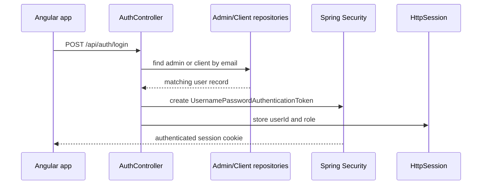

## Security boundary

The backend security policy is configured in [back-end/src/main/java/com/demo/backend/Configuration/SecurityConfig.java](../../back-end/src/main/java/com/demo/backend/Configuration/SecurityConfig.java#L15-L58). The configuration:

- disables CSRF,
- allows CORS for `http://localhost:4200`,
- permits anonymous access to auth, reservation, client, PayPal, and circuit endpoints,
- requires authentication for all other routes,
- uses a session-based security context repository.

This means requests from the Angular frontend are treated as authenticated when the browser sends the Spring session cookie. The relevant route policy is intentionally permissive for the public-facing flows that the app calls from the client UI.

## Login and session flow

The authentication endpoint is [back-end/src/main/java/com/demo/backend/Controller/AuthController.java](../../back-end/src/main/java/com/demo/backend/Controller/AuthController.java#L18-L93). Its `/api/auth/login` handler checks both the admin repository and the client repository. If the supplied credentials match an admin or client, it calls `authenticateUser(...)` and stores both a Spring Security context and session attributes:

- `userId`
- `role`

This creates a session-backed identity that later `ClientController` and route guards rely on. The logout endpoint clears the security context and invalidates the session.



A caption for the sequence above: the backend builds a security context and session on successful login so later requests can be authorized without sending a bearer token.

## Client profile and access checks

The client profile endpoint in [back-end/src/main/java/com/demo/backend/Controller/ClientController.java](../../back-end/src/main/java/com/demo/backend/Controller/ClientController.java#L15-L75) checks `HttpSession` for `userId`. If the session does not include it, the endpoint returns `401` with an error message. This is the backend half of the route guard flow used by the Angular app.

The same controller also enforces permission rules on updates and deletions:

- an admin can update or delete any client account,
- a client can only update or delete their own account,
- other requests return `403`.

This is enforced by comparing `session.getAttribute("role")` and `session.getAttribute("userId")` against the target resource.

## Registration and account creation

Registration is delegated to [back-end/src/main/java/com/demo/backend/Service/ClientService.java](../../back-end/src/main/java/com/demo/backend/Service/ClientService.java#L15-L39). The service checks:

- password confirmation,
- duplicate email,
- duplicate phone,
- password encoding via `PasswordEncoder`.

It stores the client with `ROLE_CLIENT` and links the user to the default admin record loaded by `adminRepository.findById(1)`. The validation behavior is exercised by unit tests in [back-end/src/test/java/com/demo/backend/ClientServiceTest.java](../../back-end/src/test/java/com/demo/backend/ClientServiceTest.java#L31-L118).

## Frontend client-side coupling

The frontend calls `/api/auth/login` and `/api/clients/profile` from [front-end/src/app/services/auth.service.ts](../../front-end/src/app/services/auth.service.ts#L7-L68). It stores the logged-in user in browser storage and uses `withCredentials: true` so the session cookie is sent back to the backend. The route guard in [front-end/src/app/auth.guard.ts](../../front-end/src/app/auth.guard.ts#L1-L22) calls `AuthService.checkSession()` and redirects unauthenticated users to `/auth/login`.

This is the session handshake across the stack: Angular asks “is there a valid session?”, the backend checks the session cookie, and the app either permits or redirects.

## Focused validation

The most relevant repository tests are the service-level checks for registration and validation in [ClientServiceTest.java](../../back-end/src/test/java/com/demo/backend/ClientServiceTest.java#L31-L118). The practical full-project validation remains:

```bash
cd back-end && ./mvnw test
```

The frontend route guard itself has no dedicated test in the repo; the stronger verification is runtime behavior through the session-backed Angular and backend flow. 
