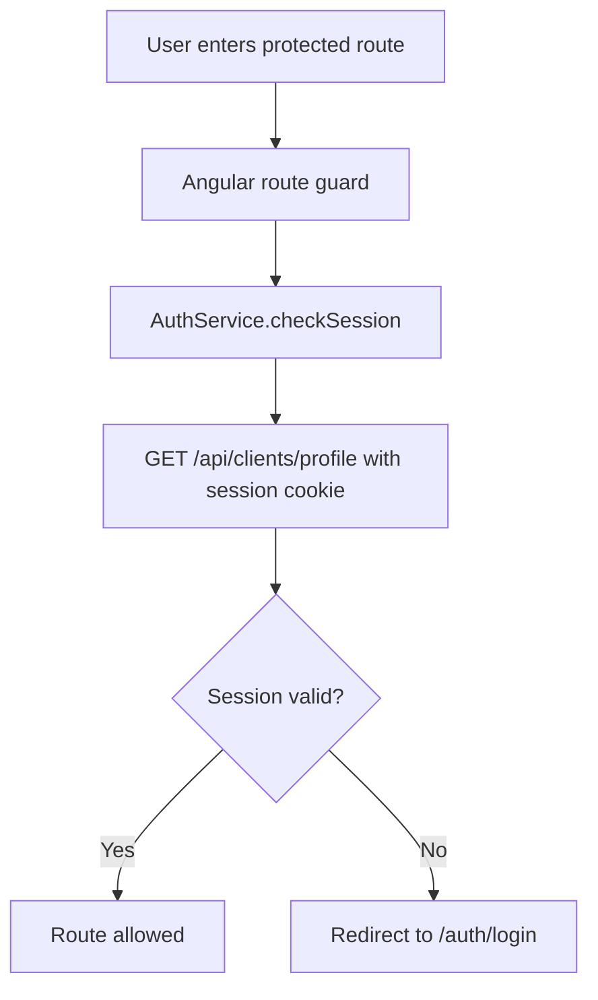

## Top-level router

The main router is defined in [front-end/src/app/app.routes.ts](../../front-end/src/app/app.routes.ts#L1-L22). It registers three route groups and provides redirects for the empty path and PayPal success/cancel pages:

- `auth` → login and registration flow
- `client` → protected customer-facing routes
- `admin` → admin dashboard and management screens
- `/payment/success` and `/payment-success` → payment success completion screen
- `/payment-cancel` → cancellation landing page

This matches the application’s split between public/account flows and more sensitive management screens.

## Client route protection

The client route tree in [front-end/src/app/client/client.routes.ts](../../front-end/src/app/client/client.routes.ts#L1-L46) adds the `authGuard` to the critical client screens. The guard is implemented in [front-end/src/app/auth.guard.ts](../../front-end/src/app/auth.guard.ts#L1-L22):

- injects `AuthService`
- calls `checkSession()`
- waits for the first emitted value with `take(1)`
- allows access only when a user object exists
- otherwise redirects to `/auth/login`

This is the browser-side counterpart to the backend session lookup in [backend/security-and-auth.md](../backend/security-and-auth.md).

## Session synchronization

The session state is kept in [front-end/src/app/services/auth.service.ts](../../front-end/src/app/services/auth.service.ts#L7-L68). It:

- stores the user in a `BehaviorSubject`,
- persists the current user in `localStorage` when running in the browser,
- sends `withCredentials: true` on login and session checks so the backend session cookie is included,
- clears the stored session on logout or auth failure.

The service is the bridge between the browser’s persisted client state and the backend’s session-based authorization model.

## Admin route handling

The admin route tree in [front-end/src/app/admin/admin.routes.ts](../../front-end/src/app/admin/admin.routes.ts#L1-L30) sets up nested routes under a layout wrapper. It includes:

- dashboard,
- clients,
- reservations,
- trips,
- trip detail and trip creation/edit screens.

Unlike the client routes, these are not protected by `authGuard` in the current source. That means the admin area is expected to be reached only after a successful backend auth session or through the direct route structure already configured.

## Runtime flow



A caption for the diagram above: client-side access control is synchronized with the backend session by checking the profile endpoint before allowing navigation.

## Validation

The repo currently has no dedicated guard test; the most relevant smoke tests are the app-level Angular spec and the backend session checks. The practical frontend validation is:

```bash
cd front-end && npm run build
```

This checks that the router configuration and the Angular module graph are valid enough to compile even without a dedicated guard test. 
