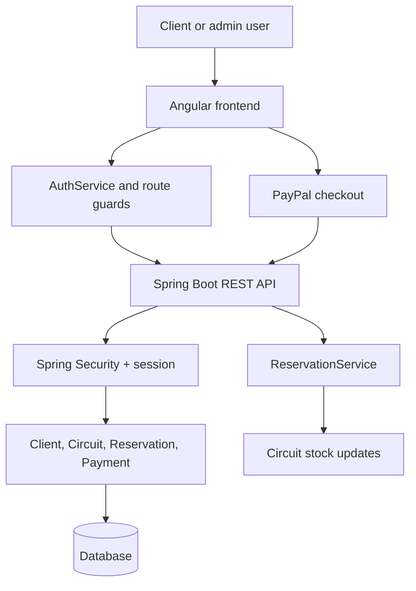

## Project map

This repository contains a Java Spring Boot API and an Angular client application built for a travel agency. The backend owns persistence, authentication, reservation logic, and the PayPal checkout flow. The frontend owns route-driven client and admin UIs and enforces session access through the Angular guard.

### Domain map

- [backend/overview.md](backend/overview.md): backend startup, main controller services, and application composition.
- [backend/security-and-auth.md](backend/security-and-auth.md): Spring Security configuration, login/logout, session-based identity, and client profile checks.
- [backend/domain-model.md](backend/domain-model.md): JPA entities and the core relationships among clients, circuits, reservations, and payments.
- [frontend/overview.md](frontend/overview.md): Angular app bootstrap, top-level route setup, and main app structure.
- [frontend/routing-and-guards.md](frontend/routing-and-guards.md): route ownership, auth guard behavior, and the client/admin navigation splits.
- [workflows/booking-and-payment.md](workflows/booking-and-payment.md): booking stock updates, reservation lifecycle, and PayPal payment capture flow.

## High-value tasks and routing

| Change area or intent | Wiki page | Primary source entrypoints | Focused tests | Minimal validation |
| --- | --- | --- | --- | --- |
| Backend startup or controller wiring | [backend/overview.md](backend/overview.md) | `BackEndApplication`, `CircuitController`, `ReservationController`, `ClientController` | `ClientServiceTest` for validation of client logic | `cd back-end && ./mvnw test` |
| Security, login, session, and role checks | [backend/security-and-auth.md](backend/security-and-auth.md) | `SecurityConfig`, `AuthController`, `ClientController`, `AuthService` | `ClientServiceTest` and backend startup smoke test | `cd back-end && ./mvnw test` |
| Domain model or persistence relationships | [backend/domain-model.md](backend/domain-model.md) | `Client`, `Circuit`, `Reservation`, `Payment`, `Admin` | JPA repository behavior is covered by service-level tests and runtime use | `cd back-end && ./mvnw test` |
| Frontend bootstrap or route structure | [frontend/overview.md](frontend/overview.md) | `app.routes.ts`, `app.ts`, `admin.routes.ts`, `client.routes.ts` | `front-end/src/app/app.spec.ts` | `cd front-end && npm test -- --watch=false --browsers=ChromeHeadless` |
| Route protection or session checks | [frontend/routing-and-guards.md](frontend/routing-and-guards.md) | `auth.guard.ts`, `AuthService`, `client.routes.ts` | Angular component test coverage is light; verify route protection via runtime flow | `cd front-end && npm run build` |
| Reservation creation or PayPal checkout | [workflows/booking-and-payment.md](workflows/booking-and-payment.md) | `ReservationService`, `PaypalService`, `PaypalController`, `ReservationController` | Service and runtime tests for domain logic; no dedicated PayPal integration tests in repo | `cd back-end && ./mvnw test` |

## Runtime map

The diagram above shows the main runtime relationships: the frontend calls the API with session cookies, the backend authenticates users with Spring Security, and the reservation flow updates the circuit inventory before an external PayPal order is created and later captured.

## Backlog

No valid deferrals are recorded for this initial wiki. The repository is small and the current source provides enough evidence for the major runtime domains and workflows.
