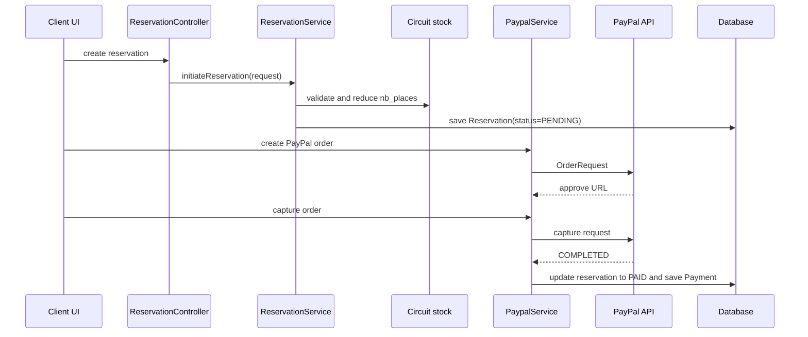

## Booking workflow

The booking flow begins in the client UI, but the business rules are enforced in the backend. The reservation API is exposed by [back-end/src/main/java/com/demo/backend/Controller/ReservationController.java](../../back-end/src/main/java/com/demo/backend/Controller/ReservationController.java#L10-L68), and the actual business logic is in [back-end/src/main/java/com/demo/backend/Service/ReservationService.java](../../back-end/src/main/java/com/demo/backend/Service/ReservationService.java#L14-L104).

The service performs the following sequence:

1. Loads the target circuit by `circuitId`.
2. Rejects the operation if `nb_places` is smaller than the requested number of persons.
3. Reduces the circuit’s available seats and saves the updated circuit.
4. Finds the currently logged-in client from the security context.
5. Builds a reservation with status `PENDING`.
6. Persists the reservation.

This is the real invariant behind reservations: the system only lets a booking exist when the circuit has enough seats and immediately decrements availability.

## Cancellation and update rules

The same service enforces reservation lifecycle rules:

- cancellation is only allowed when the reservation is `PENDING`,
- cancellation restores stock by adding the booked seats back to the circuit,
- updates are only valid for `PENDING` reservations,
- updates can change the assigned circuit and passenger count.

These constraints live in the transactional methods of [ReservationService.java](../../back-end/src/main/java/com/demo/backend/Service/ReservationService.java#L43-L83).

## Payment workflow

PayPal checkout is exposed through [back-end/src/main/java/com/demo/backend/Controller/PaypalController.java](../../back-end/src/main/java/com/demo/backend/Controller/PaypalController.java#L10-L29). The controller delegates to [PaypalService.java](../../back-end/src/main/java/com/demo/backend/Service/PaypalService.java#L15-L60), which:

- builds a PayPal order for the reservation total,
- sets the return URL to `http://localhost:4200/payment/success?resId={reservationId}`,
- captures the order,
- sets the reservation status to `PAID`,
- writes a `Payment` row with `PAYPAL` and `SUCCESS` status.



A caption for the diagram above: the backend reserves seats before redirecting the client to PayPal, then confirms and records the payment after the external capture completes.

## Frontend integration

The Angular client uses the service layer to call the backend endpoints for reservations and payments. The route entry that completes payment is configured in [front-end/src/app/app.routes.ts](../../front-end/src/app/app.routes.ts#L1-L22), and the success screen is [front-end/src/app/client/payment-success/payment-success.component.ts](../../front-end/src/app/client/payment-success/payment-success.component.ts).

The client-side checkout flow is therefore: create reservation → obtain PayPal approval URL → capture payment → update reservation state from the backend. The backend remains the source of truth for the final status change.

## Validation

The repo does not include dedicated integration tests for reservation and PayPal behavior. The nearest evidence is the service-layer logic itself and the backend's unit test suite for related domain validation in [back-end/src/test/java/com/demo/backend/ClientServiceTest.java](../../back-end/src/test/java/com/demo/backend/ClientServiceTest.java#L17-L205), plus the direct code paths in the reservation and payment services. The smallest repository-level validation command is:

```bash
cd back-end && ./mvnw test
```

This confirms the backend still compiles and that the covered unit tests remain green after business-rule changes. 
